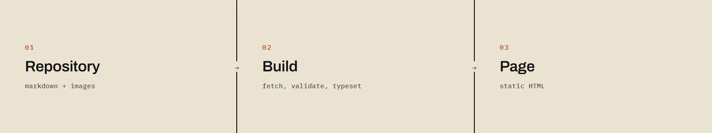

# articles

Articles published in the *Zadarmo* section of [ondrejbase.cz](https://ondrejbase.cz).

This repository is the source. The site reads it at build time and typesets the
pages from it — nothing is ever copied across by hand.

Projects don't live here. Each project is its own repository, with its own code
and its own README.

## Layout

```
2026-08-27-writing-lives-on-github.en.md   the text in English
2026-08-27-writing-lives-on-github.cs.md   the same text in Czech
images/
  flow.webp                                images belonging to the texts
```

The filename carries the date, the slug and the language — `YYYY-MM-DD-slug.en.md`.
The date is optional, the language suffix (`.en` / `.cs`) is not. Two files
sharing a slug are the same text in two languages; the site links them by slug,
not by title.

English is the primary language here. Czech is a translation.

## Front matter

The keys are Czech because they are the site's own schema — that part isn't a
translation, it's a contract.

```yaml
---
nazev: Page title
typ: clanek        # clanek (article) | projekt (project)
druh: NOTE         # label above the title, set in caps
popis: Standfirst under the title, also the blurb in the listing. One or two sentences.
---
```

For `typ: projekt` only: `jazyk` (programming language), `licence`,
`aktualizovano` (quoted date), `odkaz` (repository URL).

A missing required key fails the site build. That is deliberate.

## Images

Referenced by relative path, so they render here on GitHub too. The site
rewrites the path to its own at build time.

```html
<figure>
  
  <figcaption>Caption under the image.</figcaption>
</figure>
```

`width` and `height` are the file's real dimensions — without them the page
jumps as images load. Use `.webp`.

## Full rules

The complete set, including what each part does, lives in the site repository
under `docs/format-ukazek.md`.
